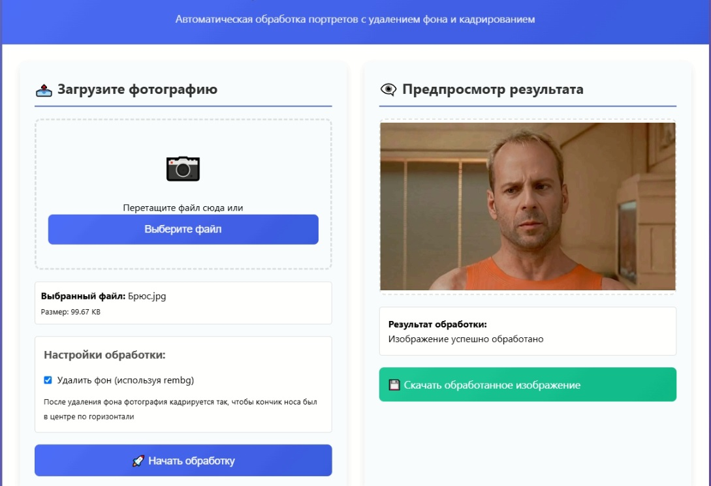
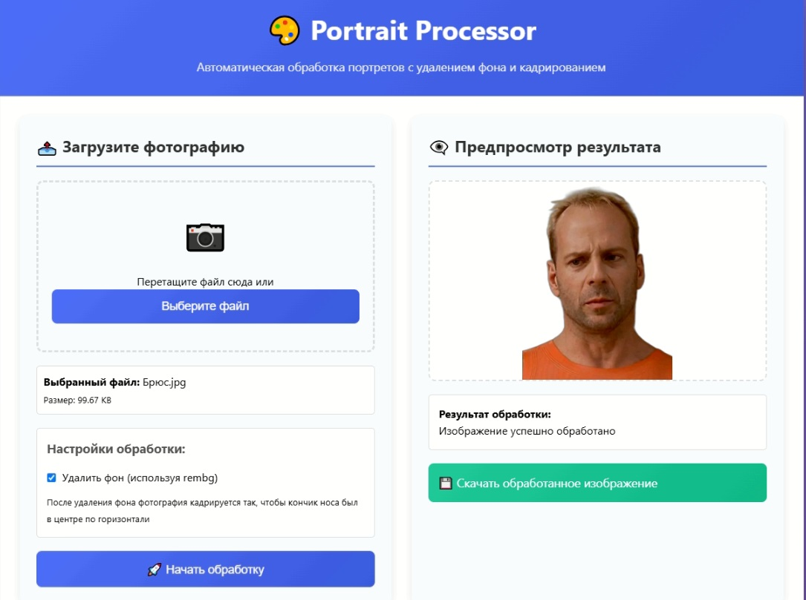

# Portrait Processor SOAP Web Service
&emsp;Сервис для автоматической обработки портретных фотографий с возможностью удаления фона, кадрирования и улучшения качества. Предоставляет SOAP API и веб-интерфейс для ручной загрузки. 
Проект предназначен в первую очередь для ускорения фотографирования с помощью веб камер посетителей в таких подразделениях как бюро пропусков, отделы кадров, учебные отделы и получения однообразного результата без необходимости ручной обработки изображений.

# 📋 Содержание
Возможности

Технологии

Установка

Запуск

Использование

Веб-интерфейс

SOAP API

SOAP клиент

Структура проекта

Описание алгоритма обработки

Решение проблем

Автор

Лицензия

# ✨ Возможности
Автоматическая обработка портретов:

Детекция лица и определение положения кончика носа

Удаление фона (с помощью rembg) с сохранением одежды

Кадрирование по правилам:

Кончик носа всегда в центре по горизонтали

Лицо занимает ~50% высоты кадра

Соотношение сторон 4:3 (если не выходит за границы)

При выходе за границы – симметричная обрезка или сдвиг

Изменение размера до 600×800 пикселей с сохранением пропорций

Улучшение качества (резкость, контраст, насыщенность)

SOAP API с ручной обработкой XML и автоматической генерацией WSDL

Веб-интерфейс для загрузки, просмотра и сохранения результата

SOAP клиент для тестирования сервиса прямо из браузера

Полная совместимость с Python 3.12 (не используется Spyne)

# 🛠 Технологии
Python 3.12+

Flask – веб-фреймворк

lxml – обработка XML для SOAP

OpenCV – детекция лиц

Pillow – обработка изображений

rembg – удаление фона (опционально)

waitress – продакшн-сервер

# 📦 Установка
Клонируйте репозиторий или создайте структуру папок вручную:

mkdir portrait_processor_soap

cd portrait_processor_soap

mkdir templates static

Создайте виртуальное окружение и активируйте его:

python -m venv venv

source venv/bin/activate      # Linux/Mac

venv\Scripts\activate         # Windows

Установите зависимости:

pip install -r requirements.txt

requirements.txt:

Flask==2.3.3

lxml==4.9.3

Pillow==10.0.0

opencv-python==4.8.1.78

numpy==1.24.3

rembg==2.0.50

waitress==2.1.2

Поместите файлы проекта в соответствующие папки согласно структуре.

# 🚀 Запуск

python app.py

Сервер запустится на http://localhost:5000.

Доступные адреса:

Веб-интерфейс: http://localhost:5000/

SOAP-сервис: http://localhost:5000/soap

WSDL: http://localhost:5000/wsdl

SOAP-клиент: http://localhost:5000/soap-client

Проверка здоровья: http://localhost:5000/health

# 🖥 Использование
Веб-интерфейс
Откройте http://localhost:5000/

Перетащите или выберите файл изображения (JPG, PNG, BMP, GIF, до 10 МБ)

При необходимости снимите галочку «Удалить фон»

Нажмите «Начать обработку»

После завершения вы увидите результат и кнопку «Скачать обработанное изображение»

SOAP API
Endpoint: POST http://localhost:5000/soap

Заголовки:

text
Content-Type: text/xml; charset=utf-8
SOAPAction: http://portrait-processor-service.ru/ProcessPortrait
Пример запроса:

xml
<?xml version="1.0" encoding="UTF-8"?>
<soapenv:Envelope xmlns:soapenv="http://schemas.xmlsoap.org/soap/envelope/" 
                  xmlns:por="http://portrait-processor-service.ru">
   <soapenv:Header/>
   <soapenv:Body>
      <por:ProcessPortrait>
         <por:image_base64>BASE64_ENCODED_IMAGE</por:image_base64>
         <por:use_background_removal>true</por:use_background_removal>
      </por:ProcessPortrait>
   </soapenv:Body>
</soapenv:Envelope>
Пример успешного ответа:

xml
<?xml version="1.0" encoding="UTF-8"?>
<soapenv:Envelope xmlns:soapenv="http://schemas.xmlsoap.org/soap/envelope/" 
                  xmlns:por="http://portrait-processor-service.ru">
   <soapenv:Body>
      <por:ProcessPortraitResponse>
         <por:result>success</por:result>
         <por:message>Изображение успешно обработано</por:message>
         <por:processed_image_base64>BASE64_ENCODED_RESULT</por:processed_image_base64>
         <por:timestamp>2024-01-01T12:00:00</por:timestamp>
      </por:ProcessPortraitResponse>
   </soapenv:Body>
</soapenv:Envelope>
Пример ответа с ошибкой:

xml
<?xml version="1.0" encoding="UTF-8"?>
<soapenv:Envelope xmlns:soapenv="http://schemas.xmlsoap.org/soap/envelope/">
   <soapenv:Body>
      <soapenv:Fault>
         <faultcode>soapenv:Server</faultcode>
         <faultstring>Ошибка обработки: ...</faultstring>
      </soapenv:Fault>
   </soapenv:Body>
</soapenv:Envelope>
WSDL: доступен по адресу http://localhost:5000/wsdl

SOAP клиент
Откройте http://localhost:5000/soap-client

Загрузите изображение (до 2 МБ)

При необходимости измените настройки

Нажмите «Отправить SOAP запрос»

Результат появится ниже, его можно скачать

# 📁 Структура проекта

portrait_processor_soap/

├── app.py                  # Основное Flask-приложение и маршруты

├── portrait_processor.py   # Логика обработки изображений

├── soap_service.py         # Парсинг и генерация SOAP-сообщений

├── requirements.txt        # Зависимости

├── README.md               # Документация

├── templates/

│   ├── index.html          # Веб-интерфейс

│   ├── soap_client.html    # SOAP-клиент

│   └── wsdl.xml            # Шаблон WSDL

└── static/

    └── style.css           # Стили для веб-интерфейса
# 🧠 Описание алгоритма обработки
Загрузка изображения – из файла или base64.

Детекция лица – каскады Хаара (frontal + profile). При неудаче используется центральная область.

Определение кончика носа – оценка: центр лица по горизонтали, 65% высоты лица от верхней границы.

Расчёт области кадрирования:

Высота кадра = 2 × высота лица (лицо ~50% высоты).

Ширина = высота × 0.75 (соотношение 4:3).

Центрирование по кончику носа.

Корректировка при выходе за границы:

сверху/снизу – сдвиг к границе;

слева/справа – симметричная обрезка.

Добавление отступа сверху для волос (5% высоты лица).

Удаление фона – с помощью rembg, если доступно.

Кадрирование – вырезается рассчитанная область.

Изменение размера – до 600×800 с сохранением пропорций.

Улучшение качества – фильтрация, повышение резкости, контраста, насыщенности, яркости.

Сохранение – в формате JPEG с высоким качеством.

# ❗ Решение проблем
Ошибка 500 при отправке SOAP запроса
Проверьте логи сервера – там будут подробные сообщения об ошибках.

Убедитесь, что изображение не слишком большое (для SOAP клиента ограничение 2 МБ).

Проверьте, что rembg установлен корректно (если используется удаление фона).

Попробуйте отправить запрос через встроенный SOAP-клиент – он выводит отладочную информацию.

Убедитесь, что в soap_service.py правильно обрабатываются пространства имён.

Не удаляется фон
Убедитесь, что библиотека rembg установлена: pip install rembg.

При первом запуске rembg может загружать модель – это занимает время.

Если rembg недоступен, фон не удаляется, но остальная обработка выполняется.

Долгая обработка
Обработка может занимать 5–15 секунд в зависимости от размера изображения и наличия rembg.

Для ускорения можно отключить удаление фона.

Ошибки при установке rembg
rembg требует дополнительных зависимостей. Если возникают проблемы, можно временно отключить удаление фона (установите use_background_removal=False).

Альтернативно используйте pip install rembg[gpu] для GPU-ускорения.

# © Автор
Сорокин Александр (СПбГУ)

# 📄 Лицензия
MIT License. Свободное использование, модификация и распространение.

Примечание: Проект протестирован на Python 3.12. При использовании других версий возможны незначительные отличия.